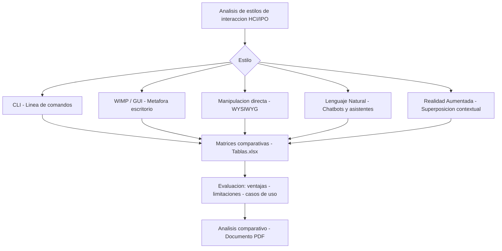

# Estilos y Paradigmas de Interacción Persona-Ordenador

> Análisis comparativo de los estilos y paradigmas de interacción en la disciplina HCI/IPO.

## Descripción

---

Análisis teórico-práctico de los principales **estilos y paradigmas de interacción** en la disciplina de Interacción Persona-Ordenador (IPO/HCI): desde interfaces de línea de comandos hasta los paradigmas emergentes de realidad aumentada y agentes conversacionales. Se evalúan las ventajas, limitaciones y casos de uso óptimos de cada estilo.

## Estilos de interacción analizados

| Estilo | Características | Aplicaciones típicas |
|---|---|---|
| **CLI** | Eficiencia, curva de aprendizaje alta | Herramientas de desarrollo, administración |
| **WIMP/GUI** | Intuitividad, metáfora del escritorio | Aplicaciones de productividad |
| **Manipulación directa** | Feedback inmediato, WYSIWYG | CAD, editores gráficos |
| **Lenguaje natural** | Baja fricción, ambigüedad semántica | Chatbots, asistentes virtuales |
| **Realidad aumentada** | Inmersión, superposición contextual | Industrial, educación, salud |

## Contenido del repositorio

| Archivo | Descripción |
|---|---|
| `*.pdf` | Análisis comparativo completo |
| `Tablas.xlsx` | Matrices comparativas de estilos |

## Contexto académico

**Asignatura:** Interacción Persona-Ordenador · **Institución:** Ingeniería Informática
**Autor:** Alejandro De Mendoza — Ingeniero Informático · Especialista Ingeniería de Software

---

## Arquitectura

## Autor

**Alejandro De Mendoza**  
Ingeniero Informático · Especialista en IA · Especialista en Ingeniería de Software · Máster en Arquitectura de Software

